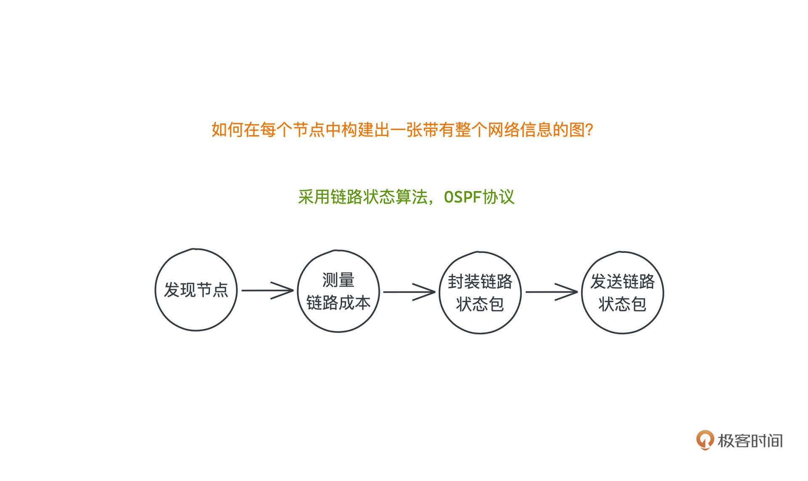
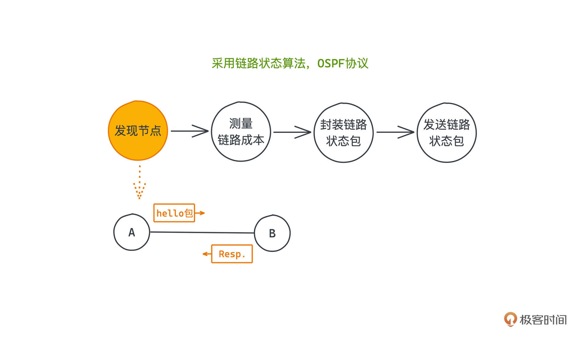
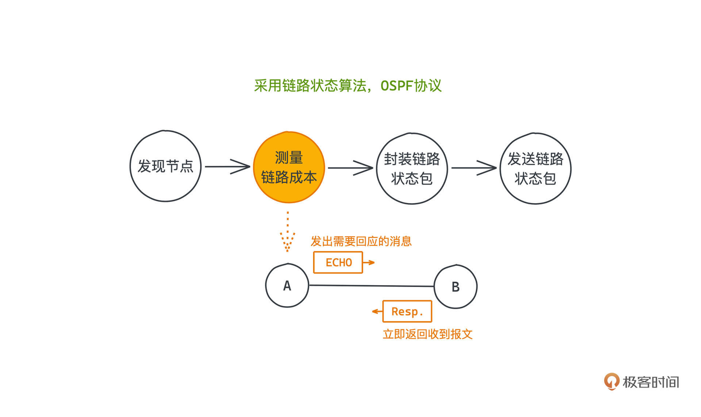
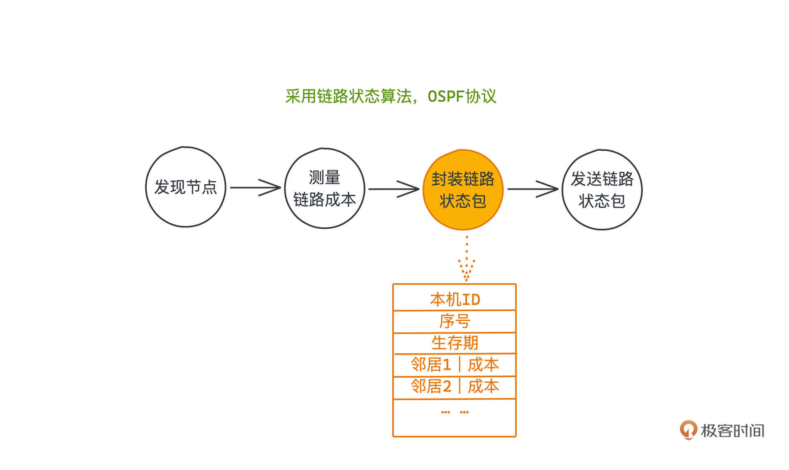
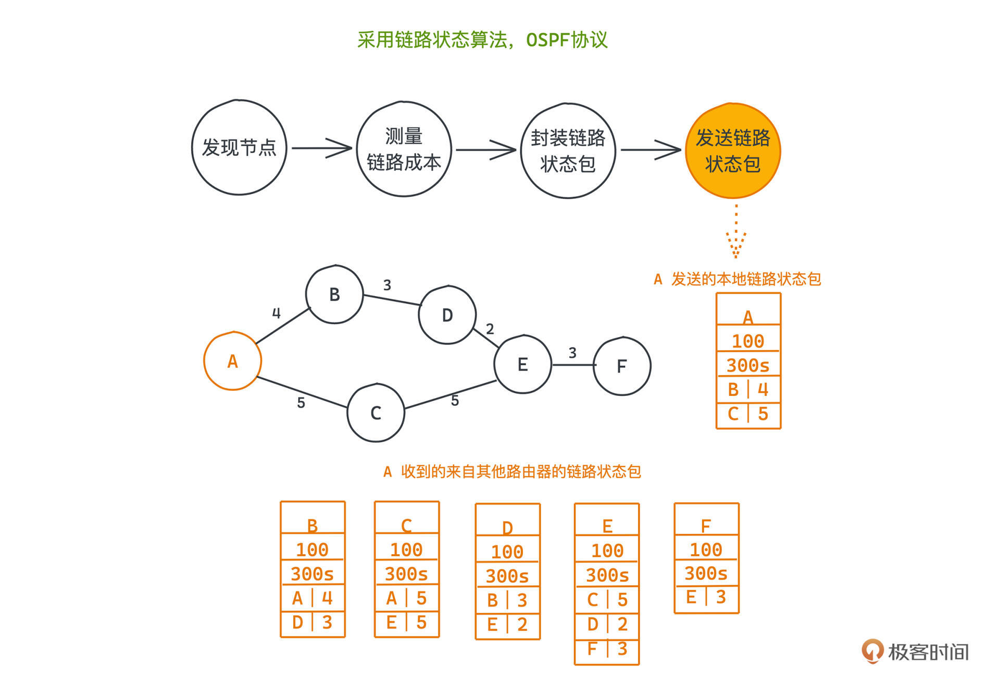
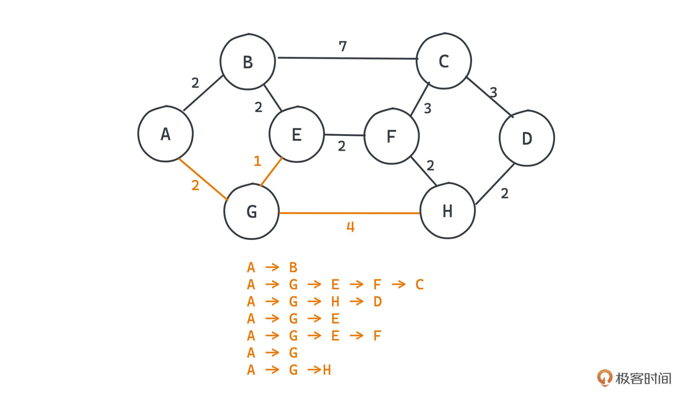
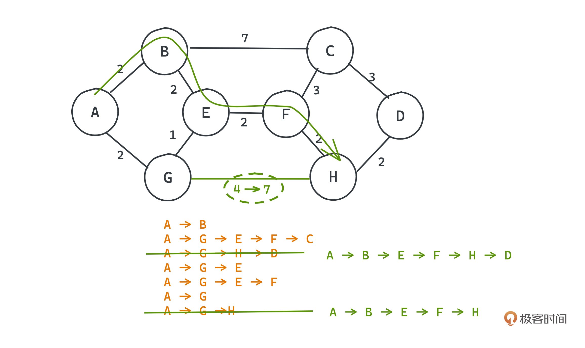

# 18｜选路算法：链路状态算法是如何分发全局信息的
<audio src='./18｜选路算法：链路状态算法是如何分发全局信息的.mp3' controls></audio>
你好，我是微扰君。

上一讲，我们介绍了网络中选路算法的背景和单源最短路问题的经典算法Dijkstra算法，还记得为什么网络中需要选路算法吗？

计算机网络很复杂，但核心作用就是把不同的节点连接在一起，交换信息、共享资源，每个节点自己会维护一张路由表，选路算法所做的事情就是：构建出一张路由表，选择出到目标节点成本最低通常也是最快的路径。

而Dijkstra算法是求解单源最短路问题的经典算法，基于贪心的思想，我们从源点开始，一步步搜索最近路径，构造一颗最短路径树。它在网络路由问题中的应用就是我们今天要学习的链路状态算法。

具体如何解决网络路由问题呢？带着这个问题，我们马上开始今天的学习。

## 网络路由问题

我们知道路由器最大的作用就是转发决策，动态路由算法的作用就是，帮助路由节点在动态变化的网络环境下建立动态变化的路由表，而每个路由表记录，本质就是当前节点到目标节点的最短路。

链路状态算法的思路就是： **先在每个节点上都通过通信构建出网络全局信息，再利用Dijkstra算法，计算出在当前网络中从当前节点到每个其他节点的最短路，从而把下一跳记录在路由表中**。

对于最短路问题，我们可以用之前学过的转化为图问题的思路，把网络抽象成一个有向图，也就是网络拓扑图。

图中每个节点就是一台台路由设备，而 **节点之间的边的权重（边权）就代表着某种通信成本，我们一般叫链路成本**，它有很多种定义方式，比如：

- 网络通信时间，最常用的成本衡量标准，选出了最短路也就意味着选出了网络当前时刻下，从源节点到目标节点延时最低的数据传输路线。
- 带宽或者链路负载，有时候也会作为成本的度量，带宽大负载低的路径成本就低，反之成本更高；在这种构建方式下，选出的是带宽比较充裕的路线，用户往往可以享受到更快的带宽速度。

后面我们会以网络通信时间也就是链路延时作为链路成本的策略来讨论，其他指标核心的问题解决思想是类似的。

这里你可能会问了，为什么网络是一个有向图呢？道理很简单，我们以延时作为边权的场景为例，两个节点双向通信的速度很可能是不一样的，所以自然是一个单向图。

有了拓扑图的定义，我们如何在每个节点中都构建出这样一张带有整个网络信息的图呢？这个问题还是没有解决。

在这个动态路由问题里，所有的节点其实都只是网络中的一部分，不同于静态路由的管理员直接有全局的上帝视角，动态路由下的每个节点能真正触达的信息，也只有和自己直接相邻的节点传来的0和1。所以， **要构建网络，我们自然也只有通过通信的方式了**。



在各种网络选路协议中，OSPF协议采用的就是链路状态算法，它把链路状态信息的获取分成了4个主要步骤：发现节点、测量链路成本、封装链路状态包、发送链路状态包。

### 发现节点

节点想要获取全局的链路信息，显然只能通过和邻居间交换自己知道的信息，才有可能构建出全局的网络图。那第一步当然是要发现和自己相邻的所有节点，并在本地维护这个邻居信息。

发现节点具体怎么做呢？

其实也很简单，就是直接向网络广播一条 `hello` 消息，我们称为 `hello` 包。所有能直接收到这条消息的一定都是一跳的邻居。协议规定，收到这条消息的节点必须回应一条Response消息，告知自己是谁。



所以每个节点 **只要统计自己发出hello后收到的回应数量**，就可以知道自己和哪几个节点相邻，也知道了它们的地址之类的信息，保存在本地就可以了。

### 测量链路成本

现在每个路由器都有了自己的邻居信息，接下来要做的就是衡量边权也就是链路成本。

每个节点想要衡量自己和邻居之间的传输成本，没什么别的办法，试一下就行了。

协议规定，每个节点向自己的邻居发送一个特殊的echo包，邻居收到之后，必须原封不动地把echo再返回给发出echo的节点，这样， **每个节点只需要统计一下自己从发出echo到收到echo的时间差，就可以用它来估计和邻居之间的网络传输时延了**，从而也就可以计算出链路状态算法所需要的链路成本了。



当然由于网络传输是不稳定的，我们会多次测量，取出均值，这样的时间我们有时也叫RTT，round-trip-time。

如果你经常打游戏，可能会在测速工具或者游戏界面中看到过这个词，RTT是最常见的用于衡量网络时延情况的指标，在许多系统里都会用到。我在工作中维护过的长连接网关就有一个这样的需求，要求采样统计消息时延作为监控指标，我们当时就会定期在应用层面上发送echo包，统计来回时间，以达到监控网络情况的效果。

### 封装链路状态包

现在，每个路由器都知道自己到所有邻居节点的链路成本了。要让每个节点都能构建出整个网络图，显然需要让自己知道的信息尽快扩散出去，也尽快收集别人的信息来拼接出整个路由的拓扑图。

这就要求我们把每个节点已知的信息封装成一个数据包，然后在网络中广而告之。这个数据包我们就叫做链路状态包，

链路状态包中至少要包含几个字段呢？

首先是本机ID，指出链路状态包的发送方，说明当前节点是谁；其次，我们前两步获得的已有链路信息当然也要写上，也就是找的到邻居列表和当前节点到每个邻居的链路成本（前面测出来的通信时延）。

另外我们知道网络是在时刻动态变化的，考虑到包的有效性问题，每个包不可能是永久有效的，过了一段时间之后就应该让这个包自动失效。所以还需要一项生存期，标记这个包中的成本记录有效的时间窗口。

除此之外， **OSPF协议还引入了一个关键字段：序号，标示当前状态包是发送方发出的第几个包**。因为在网络中传输内容时，出于各种原因可能会产生错序的情况，这个序号就能帮助接收方衡量这个包是老的包还是新的包。其实，序号这种思想贯穿了计算机网络各个层次协议的设计，在许多应用场景下也会通过序号，帮助我们进行消息传递的排序或者去重。

在OSPF协议中4项内容是这样组织的，本机ID、序号、生存期、邻居｜成本，你可以看这张图：



### 发送链路状态包

有了链路状态包，那最后一个步骤自然是发送这些包。为了确保所有的包都能被可靠地传输到每个节点，避免出现各个节点路由构建不一致等问题，我们采用泛洪的方式进行传输。

**泛洪，也是在计算机网络中常用的一种传播消息的机制，类似广播，每个节点都会把自己封装好的包和收到的包，发送或转发给所有除了该包发送方的节点**。

这样，经过一小段时间的传播，每个节点就可以收到整个网络内所有其他节点的邻居信息，从而也就相当于有了一个拓扑图中邻接表的全部信息，自然就可以在内存中构建出一张完整的带有边权的有向图了。

构造方式和我们之前讲解 [拓扑排序](https://time.geekbang.org/column/article/475478) 中构造图的过程是很类似的，你不熟悉的话也可以回去复习一下。



## 计算路由

现在每个节点都有了这样一张有向图，每个节点自然就可以利用之前我们讲解的Dijkstra算法，在有向图中计算出自己到网络中任何其他所有节点的最短路径。

```java
A的最短路
A->B
A->B->D
A->B->D->E
A->B->D->E->F
A->C

```

以拓扑图中A节点到其他节点的最短路计算为例，我们可以很容易得到每个节点的路由表：

```java
A的路由表
Destination Gateway
    B          B
    C          C
    D          B
    E          B
    F          B

```

比如从A到E的最短路径是A、B、D、E，那么在路由表中，只需要记录到E的下一跳是B就可以了。每个节点都进行类似的过程，数据包就可以在这些节点各自构建的路由表的基础上正确地传输了。

总的来说，OSPF协议中的链路状态算法通过4步，先在每个节点上都通过通信构建出网络全局信息，再利用Dijkstra算法，计算出当前网络中从当前节点到每个其他节点的最短路，把下一跳记录在路由表中。

但到目前为止，我们还没有看到链路状态算法路由动态性的体现。

## 链路状态的动态性

链路状态算法之所以是动态路由算法，还有很重要一个点就是链路状态是可以根据网络的变化自动调整的。这就要涉及今天要重点学习的最后的一个知识点了：链路状态包是什么时候发送的？

链路状态发送主要有两个时机：

- 一是我们会指定一个周期，让每个路由器都定时向外泛洪地发送链路状态包，比如30s一次。有点像心跳机制，如果长时间没有收到某个节点的链路状态包，这个节点随着之前的包中的生存期到期，就会被认为是失效节点，不会再被路由算法选作传输路线了。
- 另一个就是当每次发生重大变化，比如节点上下线、网络情况变动等等，相关节点有可能的话也会主动向外快速扩散这些消息，让网络尽快得到动态的修正。

这样简单的策略是非常强大的，以链路延时为成本的链路状态算法甚至可以非常智能地避免网络的阻塞。

我们看个例子。构建网络拓扑图之后，t0时刻，发现A和许多其他节点去往H的路由都是通过G转发最快，那这个时候，大量的信息都会发送到G路由节点中待转发。



**但计算机网络中有个“拥塞”的情况，每个节点在单位时间里能处理的信息是有限的，剩余的信息转发就需要排队，总传输时间也就变得更长了**。所以，当G节点处理的消息越来越多时，G节点就很容易进入拥塞的状态，经过G转发的链路成本也都会飙升。

但是没有关系，我们的动态路由算法很快就会发现这件事情，G自己就会更新到H的链路成本，比如从4变成7，那再稍后的t1时刻，路由A到H的路由选择就从AGH变成了ABEFH，不再经过G转发了。



## 总结

至此，整个链路状态动态路由算法我们就学完了。动态路由算法中基于Dijkstra算法的链路状态算法，核心思路就是通过节点间的通信，获得每个节点到邻居的链路成本信息，进而在每个节点里都各自独立地绘制出全局路由图，之后就可以基于我们上一讲学过的Dijkstra算法构建出路由表了。

每个节点虽然有了全局的信息，但在路由表中我们依然只需要管好自己就行，只要每个节点都履行好自己的转发义务，数据包就可以正确有效地在动态变化的网络中传输了。

链路状态中为了解决不同的问题引入了许多手段。

比如，状态包通过周期和发生变化时的发送，可以让整个路由表动态地被更新、给包加序列号进行消息传递的排序或者去重，避免过期的信息因为延迟导致误更新、通过定期发送echo包统计来回时间，来测量网络时延监控网络情况等等。

这些思想在许多场景下也多有应用，你可以好好体会。

### 课后作业

最后给你留一个小问题，链路状态算法可以动态避免网络拥塞，那它有没有什么不好的地方呢？

欢迎你留言与我一起讨论，如果觉得这篇文章对你有帮助，也欢迎你转发给身边的朋友一起学习。我们下节课见～