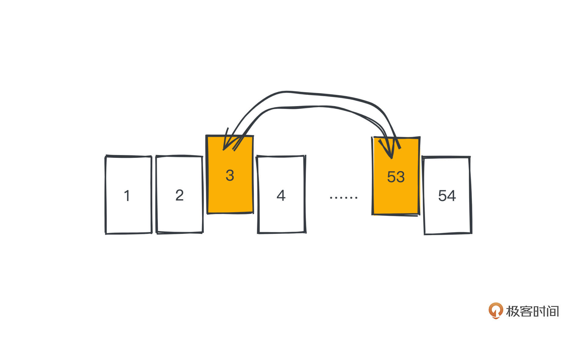
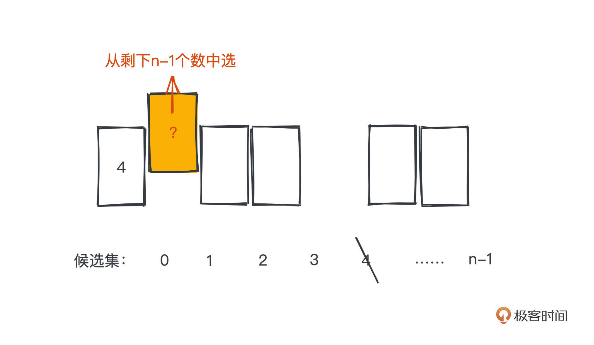
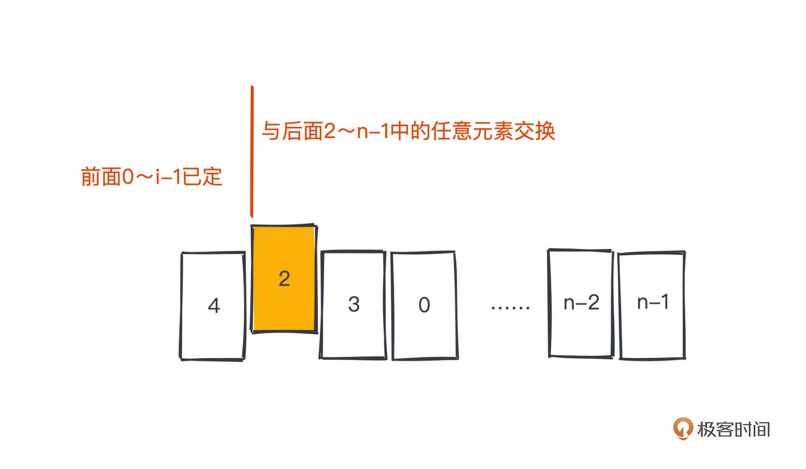

# 35｜洗牌算法：随机的哲学，如何用程序来洗一副牌？
<audio src='./35｜洗牌算法：随机的哲学，如何用程序来洗一副牌？.mp3' controls></audio>
你好，我是微扰君。

专栏正文已经结束了，在过去一段时间里我们一起学的知识，不知道你掌握得怎么样了呢？如果还意犹未尽的话，从今天开始我们会陆陆续续聊一些其他话题，作为特别番外，希望你可以和我一起继续享受其中的思维乐趣。

今天就先从一个颇有趣味的“洗牌算法” 来开始我们的番外之旅。

“洗牌算法”，顾名思义就是给一副牌，让你用计算机打乱这副牌，这也是一道常见的算法面试题，输入一个数组，让你将数组元素进行“一定程度”的随机重排，也就是使牌组变“乱”。

乍一看你是不是觉得这个问题也太简单了，只需要一点数学基础就能写出来。但是实际上，不同的实现，效率和正确性会有巨大的差异。

那现在就让我们一起来探究洗牌算法的不同实现方式吧。

## 如何洗牌

首先考虑最直观的实现，就是直接模拟现实世界里人们是如何洗牌的。

生活中一种比较常见的洗牌做法就是把牌从牌堆中切出一叠，调换其在牌组中的顺序，然后重复这个过程许多次，直至牌组被打乱至不可预测的状态，我们就认为之后的发牌是具有随机性的，所以游戏可以公平的进行。

用计算机当然可以很轻松地模拟这个过程，而且相比手动一次切出一叠，用计算机我们可以更精细的每次选出两张牌直接进行位置交换，并反复进行这个过程。直觉告诉我们，经过很多次操作之后，牌就被很好的打乱了，而且因为我们是随机交换的，所以各种可能的牌组排列理论上出现的概率是差不多的。

代码写出来并不难，大概如下：

```go
void shuffle(vector<int>& arr) {
  int n = arr.size();
  int swaps = 1000;
  for (int i = 0; i < swaps; i++) {
    int x = rand() % n;
    int y = rand() % n;
    swap(arr[x], arr[y]);
  }
}

```

但这个算法真的是正确的吗？

我们需要打乱多少次才能确保牌真的是乱的呢？这里我们选的交换次数是1000次，对于一副扑克牌来说肯定是够了，但如果只交换5次，显然没有办法覆盖所有可能出现的排列方式，那交换的次数到底如何取就是一个问题，这个数字显然会和牌组的大小有关。



不过，在讨论需要多少次才能真正打乱数组之前，我们首先要来明确定义一下“乱”这个词，毕竟这不是一个很严谨的数学描述，无法量化，在计算机的世界里，我们当然更青睐精确的描述。

对于洗牌算法来说， **“乱”可以这样定义：随机生成数组的一种排列，使数组的所有排列情况都能以等概率的方式被选出来，并且我们的方案需要覆盖所有的排列方式。**

有n个元素的数组，通过排列组合的知识，我们知道一共有 n! 种不同的排列方式，所以我们就需要有一个算法，让每种排列方式都以 1/n! 的概率出现，或者说，让每个位置出现各个元素的概率是1/n，就可以覆盖所有排列且概率相同。

具体怎么操作呢？

在对n个不同元素进行排列时，我们可以从第一位开始枚举，等概率的选择1～n中的某一个，然后进行第二位的枚举，选择剩下的n-1个元素中的某一个……直到选取最后一个元素，这样的排列总数为n!，因为我们是完全随机选择的，不会产生某些排列出现概率高于其他情况概率的情况。

## Fisher-Yates Shuffle 算法

基于这个想法，我们自然就能想到一种很直观的实现方式，Fisher-Yates Shuffle 算法。

思路就是将刚刚描述的排列过程直接翻译成代码，逐位确定数组每个位置应该选择的元素，每次选择的时候从剩余可选的元素中随机选择一个即可。



**为了维护剩余的元素，我们需要用另一个数组去存储剩余元素**，一开始放入所有的元素，然后每次确定一位就要将该元素从数组中移除掉。

翻译成代码如下：

```go
void Fisher_Yates_Shuffle(vector<int>& arr,vector<int>& res) {
     int k;
     int n = arr.size();
     for (int i=0;i<n;i++) {
     	k=rand()%arr.size();
     	res.push_back(arr[k]);
     	arr.erase(arr.begin()+k);
     }
}

```

其中 arr 就是我们待打乱的数组，res 则是最终打乱之后的排列结果。

但是相信你也看到了，这个算法的弊端很明显。数组的随机删除操作会带来O(n)的时间复杂度，所以整体的时间复杂度就是O(n^2)，并且引入了额外的数组来存放候选集时，也引入了O(n)的空间复杂度。这并不是一个理想的时空复杂度。

## Knuth-Durstenfeld Shuffle 算法

因此，Knuth 和 Durstenfeld 在此基础上进行了改进，采用直接在原始数组上操作的方式，避免了O(n)的额外空间开销，也把时间复杂度降到了O(n)。

做法和Fisher的本质其实是一样的，只不过在随机选择和交换的时候采取了一个小trick，我们来看具体是怎么做的。



仍然逐位进行选择，但是当我们在选择第i位的时候，会假设0～i-1位已经确定，那么i的可选范围其实就是当前数组的第i～n-1位，于是 **我们只需要把第i位元素和第i～n-1位元素中的任意一个元素交换，就可以实现随机选择的效果**。

翻译成代码如下：

```c++
    void shuffle(vector<int>& arr) {
        for (int i = 0; i < n; i++) {
            int tmp;
            int target = i + rand() % (n - i);
            tmp = arr[i];
            arr[i] = arr[target];
            arr[target] = tmp;
        }
    }

```

这样我们就可以逐个确定每一位元素的位置，等可能的从所有的可能项中选择，保证等概率性。所需的时间复杂度为O(n)，空间复杂度为O(1)。

看这个做法你可能还是有点疑惑，怎么严格证明这样的洗牌算法是等概率的呢？

其实我们只需要看每个位置出现各个元素的概率是不是1/n就可以了。这里直接引用我之前写的洗牌算法的力扣 [题解](https://leetcode-cn.com/problems/shuffle-an-array/solution/wei-rao-li-lun-jing-dian-xi-pai-suan-fa-11ona) 的证明：

> 先看第一个位置，由于我们是从n个元素中随机选择一个，每个元素出现的概率显然是1/n。
>
> 而对于第二个位置，我们要考虑这个元素没有出现在之前的选择中，然后是从剩下n-1个元素中随机选择一个，所以任意一个元素出现的概率是 ((n-1)/n) \* (1/(n-1)) = 1/n 。
>
> 同样，第三个位置，任意元素出现的概率应该保证前面两个位置都没有选中，那是 (n-1/n)\*(n-2/n-1)\*(1/n-2) = 1/n 。
>
> 依次递推，所以你会发现每个位置任意元素出现的概率都是相等的，1/n 。
>
> 这就可以严格的证明我们的算法是正确的。

那事实上，在我们日常业务开发中，这种需要随机的场景其实也是很多的。

比如知名的注册中心 Eureka，它客户端侧的负载均衡就是基于洗牌算法实现的，大致的做法就是把每个客户端维护的服务器的IPList打乱，然后尝试逐个请求服务器的接口，直至请求成功。

在 java.util.Collections 里也有内置的 shuffle 函数（也就是洗牌算法）用于打乱数组元素，事实上最新的 Eureka 里的随机负载均衡策略也是用JDK内置的 shuffle 函数实现的，感兴趣的话，你可以看具体 [代码](https://sourcegraph.com/github.com/Netflix/eureka@ed0da19ca1c049c87e3dbf75b6015c1861d5c2d0/-/blob/eureka-client/src/main/java/com/netflix/discovery/shared/resolver/ResolverUtils.java?L82)。

```protobuf
        public static <T extends EurekaEndpoint> List<T> randomize(List<T> list) {
	        List<T> randomList = new ArrayList<>(list);
	        if (randomList.size() < 2) {
	            return randomList;
	        }
	        Collections.shuffle(randomList,ThreadLocalRandom.current());
	        return randomList;
	    }

```

核心逻辑非常简单，就是简单的调用shuffle函数，将实现注册的IP列表通过randomize函数打乱，之后逐一请求。

## 总结

我们今天学习了三种不同的洗牌算法思路：每次随机选出两张牌交换，然后不断重复这一过程、Fisher-Yates Shuffle 算法、Knuth-Durstenfield算法。

第一种是源于日常生活中的观察，但是它不能说是正确的洗牌算法，根本原因是因为对问题没有清晰的定义，比如对于打乱的结果“乱”到底如何量化？这个问题不解决，我们就没法确定自己的算法是否是正确的。

而我们在解决计算机问题的时候，很多时候是需要去寻求本质解的。后两种思路，在找到了精确的定义之后，就可以让算法能保证数组每种排列出现的概率是等可能的了。

Knuth-Durstenfield算法是对Fisher-Yates算法的一种优化。在日常开发中，我们也需要分析每个可能产生性能开销的地方，然后尝试是否有优化的可能，这个时候可能需要一些tricks，除了灵光一现，也需要一些经验。不断学习各种算法就是一种非常好的积累经验的方法。

### 课后思考

如果别人提供了一个洗牌算法的实现，你有没有什么办法可以大致验证这个算法的正确性呢？

欢迎在留言区留下你的思考，和我一起讨论。如果觉得这篇文章对你有帮助，也欢迎转发给你的朋友或者同事一起学习。