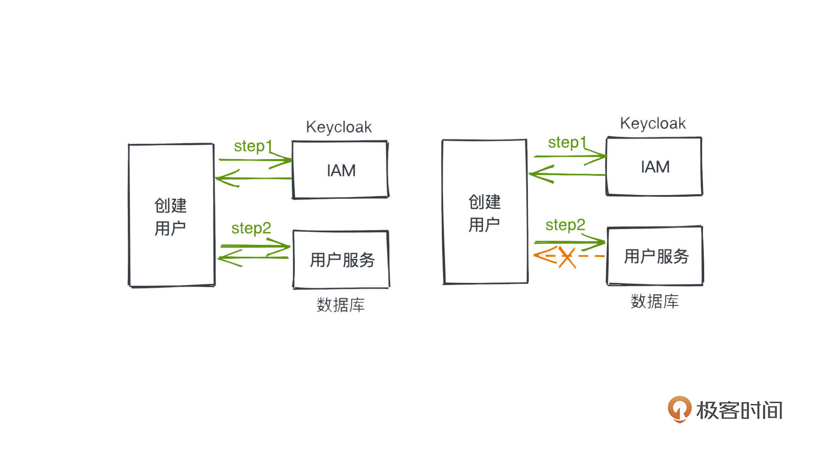
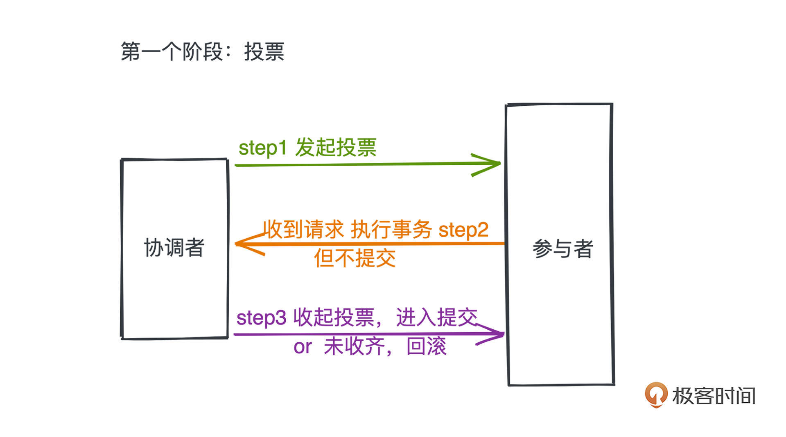
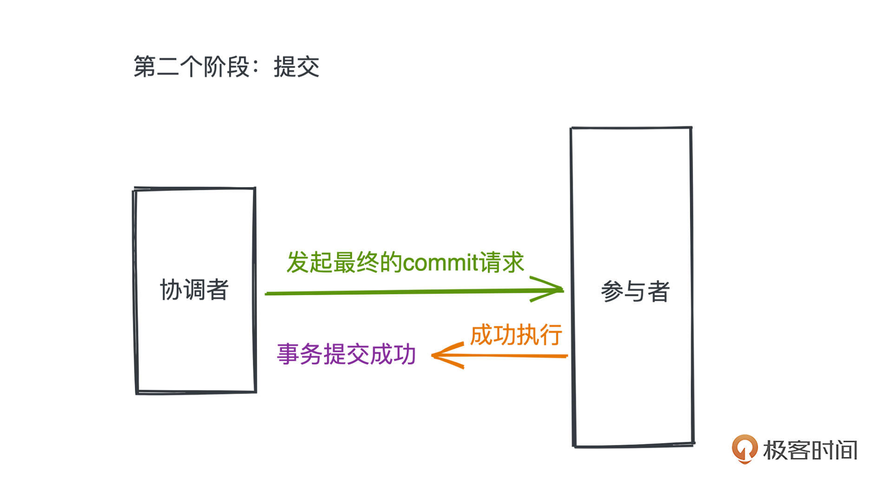

# 36｜分布式事务：如何理解两阶段提交？
<audio src='./36｜分布式事务：如何理解两阶段提交？.mp3' controls></audio>
你好，我是微扰君。

今天我们来聊一个经典问题“分布式事务”，以及它的常见解决方案“两阶段提交”。

关于事务，我们之前在介绍日志型文件系统的时候就已经一起学习过了（戳 [这里](https://time.geekbang.org/column/article/478396) 复习），主要特点就是需要保证在应用程序中，一系列连续操作要么全部成功执行，要么一个都不能执行，这个特点我们一般也称为原子性。

在单体应用中，通常用来保证事务特性的主要手段就是引入日志，比如MySQL中的redo log就是这样一种通过日志保证数据完整性的机制。

但是随着互联网不断发展，我们的应用规模也在稳固提升，单机服务已经没有办法满足需要，分布式系统自然而然也就登上了历史舞台。 **在分布式系统下，如何保证应用的事务性，就是所谓的分布式事务问题**，也是我们今天要研究的内容。

## 分布式事务问题

在分布式应用场景中，分布式事务问题是不可回避的，在目前流行的微服务场景下更是如此。

我来举一个工作遇到的实际例子。在我参与开发的一款云产品的建设中，我们引入了开源的Keycloak组件，作为用户鉴权和账号创建的认证中心服务，但同时，因为业务也有许多和用户相关的字段需要在创建用户时生成，这一部分数据我们最终选择在数据库中自行维护。

因此，创建用户的步骤就分成了两个部分，首先要去Keycloak中创建账号，然后再在我们的数据库中存储一些额外的用户信息数据。

从语义上来说，创建用户的这两个步骤应该是一个整体，要么全部成功，要么就一个都不能执行。

但是，从系统本身的角度来说，很可能出现请求IAM成功但请求用户服务失败的情况，比如调用完IAM服务之后，用户服务直接宕机了，那相应的请求自然就会失败。所以我们需要引入一些额外的手段保证这样的情况不会发生，这其实就是 **分布式事务** 所需要解决的问题。

至于如果破坏了这种多个分布式组件之间的分布式事务性，会造成什么样的后果，其实要视情况讨论。

很多时候可能也不会有什么后果，比如我们刚才的例子只有两个组件，如果能在业务代码里，就严格处理好IAM调用成功但用户服务调用失败的情况；或者在一些数据一致性本身没有很重要的场景下，并不会产生什么严重的问题。

但是如果是一些更复杂且数据一致性要求更高的情况，比如，某个电商应用的下单过程需要调用账户服务、库存服务、订单服务、物流服务等多个不同的服务，一旦数据产生不一致，就很可能导致用户付了款但是收不到商品的情况，这肯定是不能接受的，像这样涉及现金的场景，我们自然需要更妥善处理分布式事务的问题了。

现在解决分布式事务的手段有很多种，一种最常见的思路就是 **两阶段提交**，我们今天主要就来介绍这个协议，它的思路其实非常符合我们的直觉。

## 方案：两阶段提交

你很有可能听说过这个协议很多次了，不过要彻底理解到位还是需要花费一点功夫。

**首先要明确一点，分布式系统中的每个节点，在没有通信的情况下是没有办法获得全局的信息**，也就是说某个参与事务的节点并没有办法直接知道其他事务的执行情况。

那么想要保证事务的每个参与方都一起成功提交事务，我们要么通过点对点的多次通信交换信息，要么通过引入一个掌握全局信息的协调者来进行事务的最终提交。

两阶段提交采用的是后者。

记住这一点我们继续看。两阶段提交协议，把整个分布式事务的提交分成了两个阶段：投票、提交，从协议的名字上也很容易看出来。

## 投票

第一个阶段，投票。在这个阶段，我们引入的协调者会向每个事务的参与者发出一个投票请求，主要目的就是了解每个事务的参与者是否可以正常完成事务的执行，并让参与者完成大部分提交事务所需要的工作。

以分布式数据库的场景为例，在投票阶段里，包括三个步骤：

1. 协调者发起投票请求至每个参与者
2. 参与者收到请求执行事务但不提交；在数据库中会把redo log写好，但不提交
3. 协调者收齐所有参与者的投票进行后续提交操作，或者未收齐投票进行回滚操作

通过这样的第一次提交，协调者就可以感知到每个节点是否可以完成事务。如果出现某个参与者完成不了的情况，或者协调者等待超时，这个阶段就可以将事务进行回滚，而且因为事务没有正式提交，不会产生数据不一致的问题。

## 提交

有了第一个阶段的准备，当协调者发现所有参与者都进入了尚未提交但是已经执行事务的状态，我们就可以进入第二个阶段，也就是提交阶段了。

这个时候，协调者会正式要求每个参与者进行刚刚事务的提交。由于在第一个步骤里，我们已经完成了大量的准备工作，包括事务的执行（虽然还没有提交），所以这第二个步骤是很轻量的，只要网络正常，成功的概率会非常高， **这点也是分阶段很重要的意义之一，我们把更容易出错的工作和最终提交的步骤隔离开了**。

正常情况很简单，协调者向每个参与者发起最终的commit请求，并得到了成功执行，最终事务得到了正确的提交。

但是第二个阶段失败的情况有哪些呢，网上没有特别清楚的描述，我们来一起讨论一下。

### 参与者失败

第一种情况是参与者在第二个阶段里失败。

在经典的两阶段提交下，当协调者发现这一情况时， **做法很简单，就是直接回滚**。

协调者是全局里唯一有全局信息的节点，而分布式事务本身的意义就是要保证不同节点要么一起提交事务，要么一起回滚。所以，有全局信息的协调者，如果收到了任意参与者发来的提交失败或者等待超时，都应该像第一个阶段一样，立刻终止事务，并向所有参与者发起回滚的请求。

### 协调者失败

另一种情况就是协调者失败，更复杂一些，我们分类讨论。

- 第一种情况，协调者已经让部分参与者完成了提交操作

如果部分参与者已经完成了提交，说明提交的决策已经完成，并由协调者在失败之前发送给了部分参与者，这个时候其他参与者照理来说也必须提交事务。

不过由于协调者已经失败，没有收到通知的参与者除了等待协调者恢复，还有一种优化策略就是让每个参与者都去通过彼此的通信查询一下其他参与者的提交状态，如果发现已经有参与者提交了，说明自己也应该进行提交。协调者恢复之后再根据参与者是否提交的情况，判断是否提交本次事务。

- 第二种情况，还没有参与者完成了提交操作。

这个时候所有的参与者都已经完成了准备工作但没有提交，协调者就已经失败了，没有节点知道当前事务到底处于要提交还是要放弃的状态，所以只能等待协调者恢复。这也是整个两阶段提交的一个问题所在：协调者宕机则导致系统不可用，成为系统的单点。

不过总的来说，引入两阶段提交的协议之后，整个系统就可以几乎处于一个总是正确的状态了。

## 总结

今天学习的内容不太多，我们简单总结一下，在分布式系统中，需要保证事务的原子性，通常需要引入一个有全局信息的协调者，通过将事务提交分成 **投票** 和 **提交** 两个阶段和一些精细的设计，我们最终保证了整个系统在大部分时刻都处于正确的状态了。

像两阶段提交这样引入协调者的思路，在整个分布式的世界里是非常常见的，主要目的就是要获取分布式系统中的全局信息，你可以好好体会。

### 课后思考

最后留一个小小的课后思考题，学习了两阶段提交协议之后，你有没有发现这个协议的一些弊端呢，是否有办法进一步提高他的性能，比如减少整个系统的阻塞情况？

欢迎你在评论区留言与我一起讨论。如果觉得文章对你有帮助的话，也欢迎你转发给你的朋友一起学习～