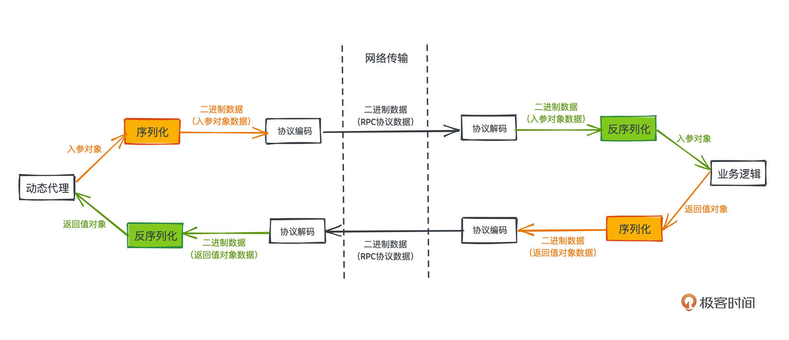
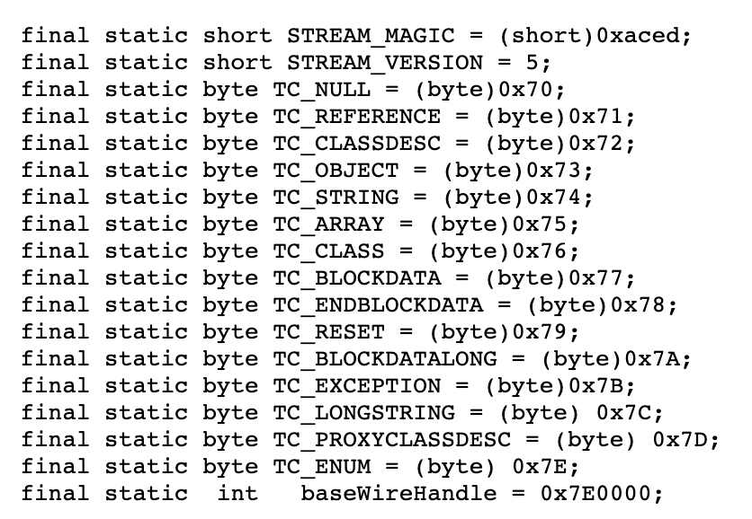
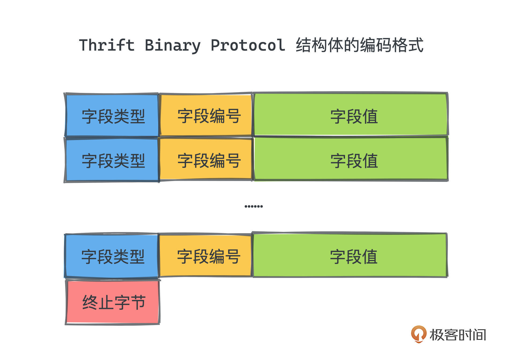

# 37｜Thrift编码方法：为什么RPC往往不采用JSON作为网络传输格式？
<audio src='./37｜Thrift编码方法：为什么RPC往往不采用JSON作为网络传输格式？.mp3' controls></audio>
你好，我是微扰君。今天我们来聊聊RPC的网络传输编码方式。

如果你有过几年后端服务的开发经验，对RPC，也就是远程过程调用，应该不会陌生。随着互联网应用的发展，我们的服务从早期流行的单体架构模式，逐步演进成了微服务架构的模式，而微服务之间通信，最常见的方式就是基于RPC的通信方式。

因此微服务的RPC框架也逐步流行开来，我们比较耳熟能详的框架包括阿里的Dubbo、Google的gRPC、Facebook的Thrift等等，这些系统的核心模块之一就是传输内容的序列化反序列化模块，它能让我们可以像调用本地方法一样，调用远程服务器上的方法。

具体来说，我们会将过程调用里的参数对象转化成网络中可传输的二进制流，从客户端发送给服务端，然后在服务端按照同样的协议规范，从二进制流中反序列化并组装出调用方法中的入参对象，进行本地方法调用。

当然最后，要用类似的方式，将方法的返回值对象传回给发起调用的客户端，这里也会经过序列化和反序列化的过程。



整个调用的过程大概就是图片这个样子，从原理上来说非常直观，相信你一看就能明白。

为什么要经过序列化和反序列化过程，本质上是因为网络传输的是二进制，而方法调用的参数和返回值是编程语言中定义的对象，要实现远程过程调用，序列化和反序列化过程是不可避免的环节。

那RPC的序列化反序列化具体是如何实现的呢？我们今天就主要讨论这一点。

## JDK原生序列化

首先来了解序列化具体是怎么实现的。其实，所有的序列化过程从本质上讲都是类似的，我们就以JDK为例详细分析。你只要掌握一个，就能一通百通，理解RPC序列化的主要思想了。

JDK原生就支持对Java对象到二进制的序列化方式，我们利用 `java.io.ObjectOutputStream` 就很容易完成序列化和反序列化。

看一个例子，代码运行后，我们预先定义好的Dog类的对象，会被序列化并写入某个文件，然后会再从该文件中读取二进制流，并反序列化出一个新的对象：

```java
import java.io.FileInputStream;
import java.io.FileOutputStream;
import java.io.ObjectInputStream;
import java.io.ObjectOutputStream;
import java.io.Serializable;

class Dog implements Serializable {
    String name;
    String breed;

    public Dog(String name, String breed) {
        this.name = name;
        this.breed = breed;
    }
}

class Main {
    public static void main(String[] args) {
        // 创建 Dog 对象
        Dog dog1 = new Dog("Tyson", "Labrador");

        try {
            FileOutputStream fileOut = new FileOutputStream("file.txt");

            // 创建 ObjectOutputStream
            ObjectOutputStream objOut = new ObjectOutputStream(fileOut);

            // 将 dog1 序列化为二进制并写出
            objOut.writeObject(dog1);

            // 读取文件
            FileInputStream fileIn = new FileInputStream("file.txt");
            ObjectInputStream objIn = new ObjectInputStream(fileIn);

            // 读出并反序列化为 newDog
            Dog newDog = (Dog) objIn.readObject();

            System.out.println("Dog Name: " + newDog.name);
            System.out.println("Dog Breed: " + newDog.breed);

            objOut.close();
            objIn.close();
        }

        catch (Exception e) {
            e.getStackTrace();
        }
    }
}

```

打印这个新对象的一些属性值之后，你会发现和序列化前的对象是完全一致的。事实上，如果对象有一些方法的话，我们在序列化反序列化之后也是可以正常运行的。

那JDK序列化具体是怎么实现的呢？

**本质就是要把Java中的类型以一种特定的协议翻译成二进制流，然后就可以依据协议再次从这个流中恢复出原始的类型。**

因为在Java中，对象的核心属性本质上就是一些成员变量，每个成员变量都有自己特定的类型和值，比如上面的例子，Dog类型就包括公共变量name和breed，两者都是String类型。当然，一个被实例化的对象的成员变量也会有对应的具体值。这些就是一个对象所包含的全部信息了。

如果把它们按照某种方式记录下来，我们自然就可以恢复出整个对象本身，从而也就可以通过网络在不同的服务器间传递参数了。

这种特定的翻译协议，在JDK中，也就是默认的序列化协议，它有一个非常清晰的 [文档](https://docs.oracle.com/javase/8/docs/platform/serialization/spec/protocol.html#a10258)。因为Java类型比较丰富，又支持类型的嵌套，协议比较复杂，这里我就简单介绍一下。

整个二进制流的编码，大致分为对象信息和类型信息两个部分：

- 对象信息，是按照成员变量顺序，依次填入具体值的二进制。
- 类型信息，通常有一组成员变量信息，包括成员变量类型、成员变量名长度和成员变量名3个部分，其中成员变量类型是用一组特殊的常量表来标示的。

具体对应关系可以看这张图，比如String类型在二进制流中就标识为0x74。



这就是序列化的基本用法和原理，很好理解吧。

## 不同序列化方式的差异

事实上，所有的序列化实现本质上都是类似这样的，都是把对象里包含的成员信息，以某种顺序，编码成不同的二进制，通过某种协议用不同的长度、分隔符和特殊符号来区分类型和具体的值。

只不过，不同的实现方式，在性能、跨语言特性等能力上有所差异。

JDK中的序列化，因为协议设计高度依赖于Java语言本身，同样的协议就很难被其他语言所支持。

而另一种序列化方式JSON，就可以认为和语言并没有强绑定关系，各大主流语言都有对JSON解析的良好支持，所以，如果采用JSON作为RPC框架中的序列化反序列化方式，通常就可以支持跨语言服务的调用。

但是JSON缺点也很明显，它本质上是纯文本的编码方式，编码空间利用率很低，导致一次RPC调用在网络上传输的二进制流长度比JDK的实现要高很多，而且，编解码需要对JSON文本进行嵌套的解析，整体上性能比较差。

**所以JSON并不是首选的RPC序列化协议**。不过如果你感兴趣，完全可以基于JSON的序列化方式实现一个自己的玩具RPC框架，相信能帮助你深入理解RPC框架的工作机制。

那么，参考JDK自带的编码方式和JSON的无语言绑定的实现方式，我们能不能进一步提升传输效率呢？答案是肯定的。

来仔细分析一下JDK编码的问题所在。我们知道，RPC调用在实现的时候，客户端和服务端通常都需要有指定服务接口的信息，这样客户端可以按照接口调用，服务端可以按照接口进行实现。也就是说，服务接口中的参数类型，在客户端和服务端通常也是都可获取的。

既然如此，我们其实完全没有必要将成员变量名等信息一起放到传输的数据中，取而代之， **如果为每个成员变量设置一个编号，在网络中传输数据的时候，只是传输编号和对应的内容，这样整体的传输数据量不就大大减少了嘛**。

而Facebook发明的Thrift正是这样做的！

## Thrift协议

当然，这也造成了Thrift协议相比于用JSON这种方式进行序列化而言，其编码方式是不足以自解释的，Thrift为了让服务器和客户端都能反序列化或序列化方法参数，需要在服务端和客户端都保存一份同样的schema文件。

你可以认为是用Thrift的语法定义了一个类。比如前面的Dog类，如果用Thrift定义的话，大致是这样的：

```protobuf
struct dog {
1: required string name,
2: required string breed,
}

```

具体语法就不展开讲解了，感兴趣你可以查阅thrift [官方文档](https://github.com/apache/thrift)。

之所以用一个特有的语法进行schema的定义，也是为了让Thrift支持更多的语言，做到语言中立。

事实上，使用Thrift的时候，不同的语言，会根据你定义的schema生成一系列代码，你只需要去依赖Thrift生成的文件，就能完成RPC的调用和实现了；schema中的每个类型，在你所使用的面向对象的语言中，也会生成一个结构相似的类。感兴趣的话你可以照着官方的sample，用你熟悉的语言尝试一下，Learn by doing it，这对你了解Thrift很重要。

那有了schema，在序列化的时候，我们自然就不需要再使用冗长的字段名了。每个序列化后的struct，二进制大约是一组连续排列的字段类型+编号+字段值：



字段值根据不同的类型，会有不同的表示方式。

而字段类型只占一字节，Thrift官方定义了一个映射表，记录了每个不同类型的字段类型值。

```protobuf
BOOL, encoded as 2
I8, encoded as 3
DOUBLE, encoded as 4
I16, encoded as 6
I32, encoded as 8
I64, encoded as 10
BINARY, used for binary and string fields, encoded as 11
STRUCT, used for structs and union fields, encoded as 12
MAP, encoded as 13
SET, encoded as 14
LIST, encoded as 15

```

对于一些定长类型比如 Bool、I16、I32 等，字段值的编排很直接，就是对应类型二进制的表示。由于每个类型的二进制长度都是确定的，我们不需要引入额外的信息进入编码。

还有一些类型，比如Map、List和Set等，是通常意义上的容器，容纳的元素数量不定，我们可以引入一个size来表示容器内具体有多少个元素。思想和许多编程语言中对数组的实现是类似的。

先看List和Set，编码方式如下：

```protobuf
Binary protocol list (5+ bytes) and elements:
+--------+--------+--------+--------+--------+--------+...+--------+
|tttttttt| size                              | elements            |
+--------+--------+--------+--------+--------+--------+...+--------+

```

tttt就是SET和LIST的类型值，size就代表具体有多少个元素，elements则按照顺序依次排列每一个元素。

对于Map来说，其编码方式也是类似的：

```plain
Binary protocol map (6+ bytes) and key value pairs:
+--------+--------+--------+--------+--------+--------+--------+...+--------+
|kkkkkkkk|vvvvvvvv| size                              | key value pairs     |
+--------+--------+--------+--------+--------+--------+--------+...+--------+

```

kkkk和vvvv代表Map中键值对的类型编号，size同样代表Map中具体有多少个键值对，然后依次排列键值对即可。

这就是Thrift Binary的编码方式了。可以看出，由于去掉了冗长的类型名称，并采用二进制而非文本的方式进行元素存储，Thrift的空间效率和性能都得到了极大的提升；再加上Thrift一开始就是语言中立的协议，广泛支持主流语言，在生产环境中得到了比较广泛的应用，流行程度应该仅次于Google的Protobuf协议。如果对Protobuf和Thrift的不同点感兴趣，你可以参考 [这篇文章](https://stackshare.io/stackups/apache-thrift-vs-protobuf)。

## 总结

今天我们一起学习了三种不同的RPC序列化方式：JDK原生序列化、基于JSON的序列化，以及基于Thrift的序列化。

现在你知道JSON的序列化为什么不那么流行了吗？主要原因就是，JSON序列化采用了文本而非二进制的传输方式，并且在序列化过程中引入了冗长的成员变量名等数据，空间利用率就很差；加上使用方还需要对JSON文本进行解析和转化，很耗费CPU资源，因此，即使JSON本身非常流行，也并没有成为主流的RPC序列化协议。

而Thrift或者Protobuf的协议，采用二进制编码，并引入了schema文件，去掉了许多冗余的成员变量信息，直接采用字段编号进行成员标识，效率很高，得到了广泛的应用。

### 课后作业

课后作业也很简单，在你熟悉的语言中使用一下Thrift搭建一个简单的RPC服务demo，体验一下Thrift的使用过程，观察一下Thrift生成的代码和你日常写的有没有什么不同。

欢迎在留言区留下你的思考，如果觉得这篇文章对你有帮助的话，也欢迎转发给你的好朋友一起学习。