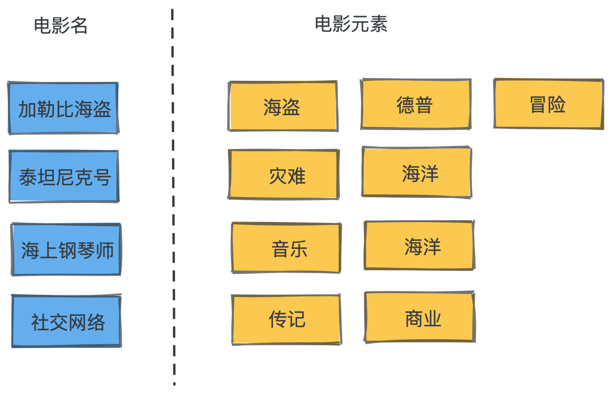
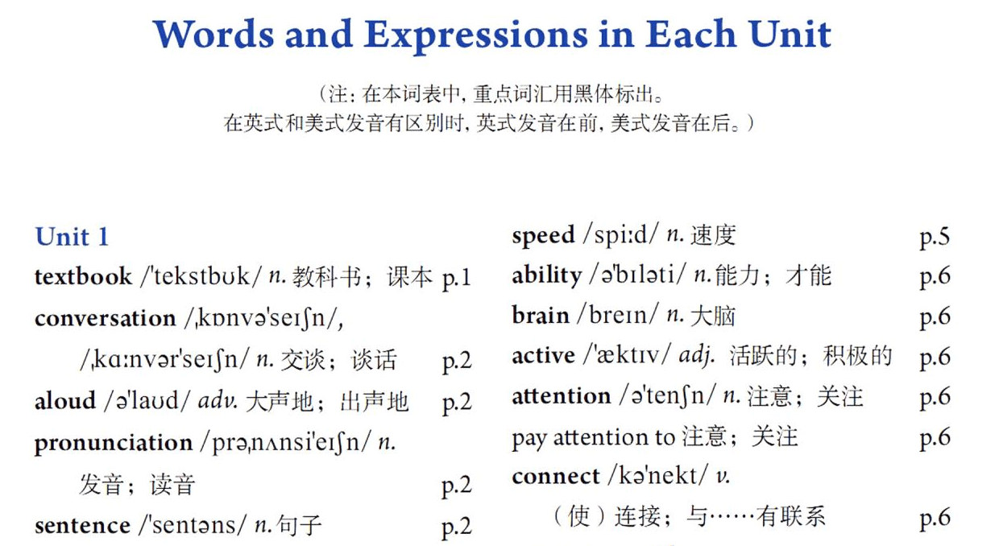
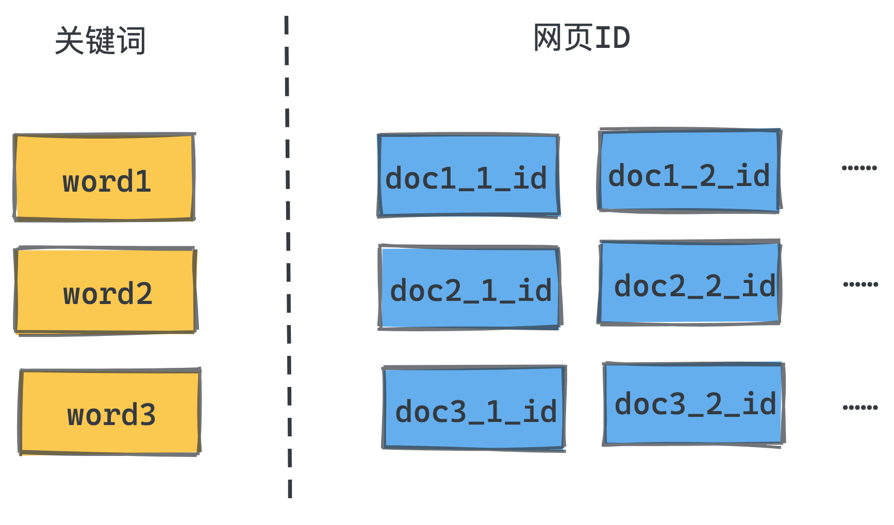

# 38｜倒排索引：搜索引擎是如何做全文检索的？
<audio src='./38｜倒排索引：搜索引擎是如何做全文检索的？.mp3' controls></audio>
你好，我是微扰君。今天我们来聊一聊倒排索引算法。

倒排索引算法，作为一种经典的索引方式，在工业界中应用非常广泛，比如搜索引擎、推荐系统、广告系统等等。在广告系统中，我们需要根据定向信息去广告库中召回合适的广告；在搜索引擎中，需要根据某个关键字返回若干搜索结果，如何做得又快又准，就离不开倒排索引的加持了。

那倒排索引背后的思想到底是什么呢？就让我们来一探究竟吧。

## 飞花令

首先，我们来看一个生活中的例子，理解一下倒排索引的大致作用机制。

不知道你喜不喜欢电影，因为我和几个朋友都很喜欢看电影，一块出去吃饭的时候，我们就会玩一个电影元素的接龙游戏，规则很简单：给定一个电影元素，然后每人轮流快速说出一个和这个元素相关的电影，谁能战到最后，谁就能免单其他人请客，比如元素是“海盗”，有关的电影就有《加勒比海盗》《菲利普船长》等等。



别看规则简单，其实这个游戏难度很高。因为，即使你看过很多和这个元素相关的电影，你也很难马上想到这些电影，而在别人真的说出这个你看过的某个电影时，你其实又很容易回想起这个元素和该电影的关联。

这也是这个游戏的乐趣所在。古人们爱玩的飞花令也正是这样一种本质上是反向信息检索的游戏（关键词是“花”，按“花”字的位置接龙背诗，比如第一个人“花”要在诗第一个字，第二个人“花”在诗句的第二个字）。

这背后显然和人脑对数据检索的方式有关。我们的大脑存储信息的时候，建立了一种和索引很相似的机制：给定一个电影名，你是很容易马上想起电影内容的，但反过来则困难很多。

## 倒排索引

面对这个问题，如果我们能建立一种从电影元素到电影名的索引，这个事情就会简单很多了。而这样的索引，我们在小时候读书的时候其实就遇到过。

我们的英语课本上，书本最后会有一个单词表，每个单词后面除了释义，还会写出在课本中出现的页码信息，这样我们复习单词的时候，就可以根据这个表快速找到对应的课文，并回忆老师讲解的内容了。



事实上，这个表就是一种在全文检索的场景下的倒排索引，它记录了每个单词在哪些文档中出现的信息，可以帮助我们快速信息检索。

类似地，当我们使用搜索引擎根据某些关键词搜索网页的时候，背后非常关键的一个技术就是倒排索引技术。

根据关键词搜索时，我们可以把网页的内容看成是全文检索的文档，当用户想要根据某个关键词对文档进行查询匹配的时候，如果没有任何倒排索引，我们所能做的就是在数据库中对每个文档进行全文遍历，查看其中是否出现某个关键词，写成 SQL 语句类似这样：

```sql
select content from pages where content like `%keyword%`

```

但是，在互联网海量数据的场景下，这样的查询效率显然是没有办法被接受的。

解决方式就是用空间换时间，在搜索引擎中引入倒排索引，提前预处理存储的全部数据，整理出每个单词到网页ID的映射关系，并记录下来；这样我们就可以得到单词到倒排列表的映射，从而快速查询关键词匹配的网页。有了倒排索引后，我们也很容易对多个关键词做与查询。



还是来举一个具体的例子帮助你理解这个过程。比如我们现在有这样4个文档：

1. 极客时间App，为用户提供前沿的IT技术、产品设计、摄影跑步等知识服务。
2. 微扰理论是极客时间上喜爱算法、喜爱学习的一个用户。
3. 微扰理论是从相关问题的确切解中找出问题的近似解的数学方法。
4. 微扰理论经常写算法题解，最近正在学习数学基础知识。

我们可以对文档进行分词，并建立倒排索引。以“极客”、“理论”、“学习”这几个词所对应的倒排列表为例，得到类似于下图的索引结构：

```protobuf
极客 -> 1 2
理论 -> 2 3 4
学习 -> 2 4
数学 -> 3 4

```

直接检索某个关键字的结果当然是显而易见的，那如果我们需要对多个关键词进行与查询如何做呢？

其实就是对这些关键词的倒排索引取交集的过程，具体实现方式和数据库的join很像，我们既可以用hash表来实现，也可以用排序+归并的方式实现，比如：

```protobuf
极客 & 理论 -> 2
数学 & 理论 -> 3
理论 & 学习 -> 2 4

```

从这个具体的例子里，相信你也能感受到，关键词匹配出来的文档应该是很多的，那如何排序呢？

因为倒排索引常用于信息检索，而信息检索质量的一个很重要的指标是 **文档和关键词的相关性**，所以，有时候倒排索引还会在倒排列表中增加每个单词在特定文档中出现的次数，也就是词频信息。

在早年大数据、统计学习乃至深度学习没有得到广泛应用时，词频信息，是文档和关键词匹配度最重要的指标之一，记录了词频信息，就可以让我们在倒排索引中对检索结果进行简单的排序。

## 小结

学完今天的内容，倒排索引的基本概念还是非常好理解的。虽然思想朴素，但是它的工业实现却非常复杂。

因为在倒排使用的场景中，所需存储查询的数据量通常很大，同时，对检索时延的要求又很高，无论是搜索引擎、推荐系统还是广告系统，每次检索的时间都要求在几十到几百毫秒以内，这就导致我们需要对倒排索引的实现持续做性能优化。

Lucene就是一个非常值得学习的全文搜索引擎库，它在数据结构上做了非常多巧妙的优化，知名的搜索引擎Elasticsearch就是建立在Lucene的基础之上实现的。

不过限于篇幅，我们今天就不对倒排索引的工业实现做展开讲解了，因为内容真的非常非常多，希望你感兴趣的话可以结合着lucene的源码细细品味。

### 思考题

如果现在让你实现一个倒排索引的库，那你会如何设计倒排列表的存储方式呢？如果要让多关键词的与查询尽量快速，你会如何设计取交集的算法呢？

欢迎你在留言区分享你的思考，如果觉得这篇文章对你有帮助的话也欢迎你转发给你的朋友一起学习。