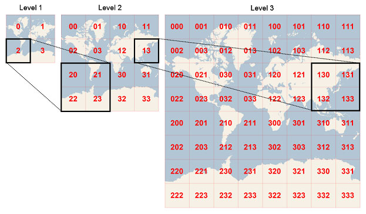
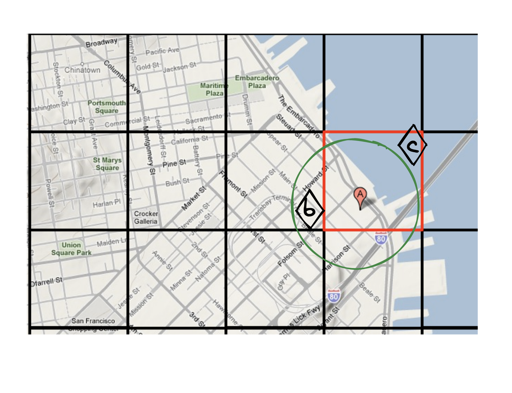
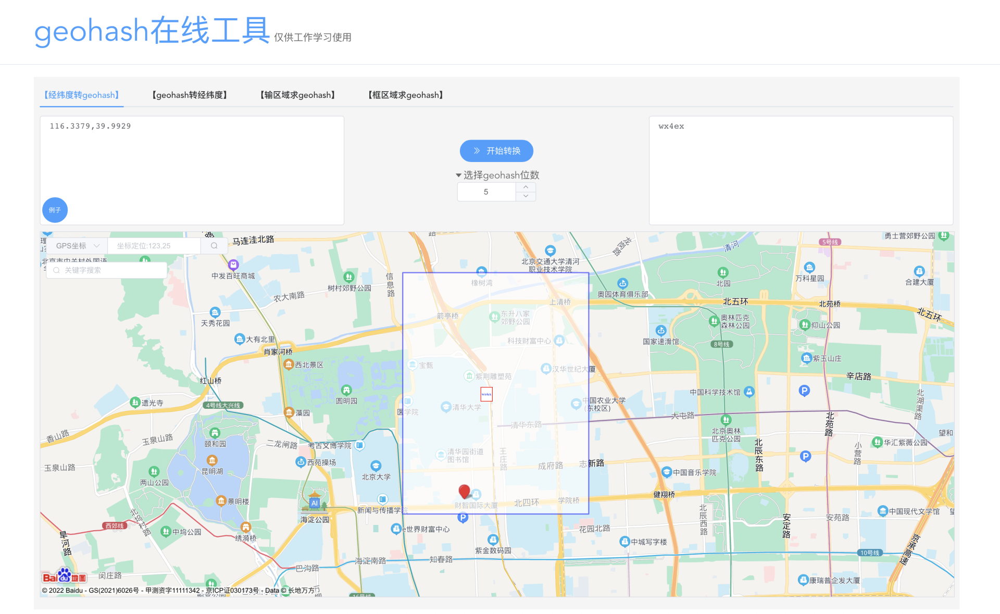
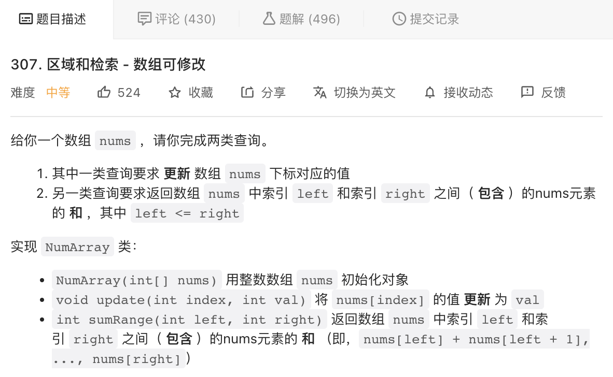

# 39｜Geohash：点外卖时我们是如何查找到附近餐厅的？
<audio src='./39｜Geohash：点外卖时我们是如何查找到附近餐厅的？.mp3' controls></audio>
你好，我是微扰君。

今天我们来聊一聊另一个和索引相关的非常有趣的问题：“地理位置检索”问题。

身处移动互联网时代，我们的衣食住行少不了各种用到地理位置信息的APP。比如周末想和朋友小聚一下，不知道去哪，我就会在美团点评上检索餐厅或者休闲场所，除了看评价，也经常会按照距离排序或者限定距离范围，找距离近、评价也高的地方，这样通勤成本就可以低很多。


再比如许多基于地理位置推荐用户的社交类APP，或者摩拜单车这样的APP里，也都有类似的地理位置检索的需求。

作为一个软件工程师，不知道你有没有思考过这背后用了什么样的算法呢？今天就让我们来一探究竟。

## 地理位置检索

来明确一下这里要说的地理位置检索问题的讨论范畴。

所谓检索，自然是说从数据中找到一些有指定特征的数据。比如，在数据库中做一个select的查询就可以认为是一种检索行为，语句中如果有where的子句，就说明我们的查询是有条件的。

**地理位置检索，正是从这样一些含有地理位置信息（通常用经纬度表示）的元素中，查询满足特定地理位置条件的元素的行为**。比如在存有店铺信息和对应经纬度的数据库中，查询某个经纬度坐标3km之内的店铺，或者进一步按照距离远近进行排序。这就是我们今天主要讨论的问题。许多数据存储系统也都支持了相关的查询实现，比如MongoDB、Redis等等。

首先，我们要知道的是，在所有的数据库，索引，在地理位置检索中并不是必须的，因为我们总可以通过遍历一遍数据库中所有的元素，来进行数据的过滤或者排序。

但是，在数据量很大的时候，这样的低效查询显然是不尽如人意的。试想，美团这个级别的互联网应用，如果在每个用户按距离查询商铺的时候，都进行全量的过滤，估计再大的数据中心也不可能在几十毫秒内完成大部分查询。

所以建立类似索引的机制是必须的，那我们具体该怎么做呢？

## 分块思想

由于地理位置检索问题历史悠久，又很有现实意义，人们对它的讨论还是比较充分的，解决方案也很多，但其中大部分想法都源于一个非常浅显的直觉——分块思想。

分块思想，在很多时候，都可以帮助我们降低算法的时间复杂度，其实这也是某种用空间换时间思想的应用。通过以块为单位记录一些额外的信息，就能加速查询或者计算的时间。

对于地理位置检索的场景，由于地理位置是二维的，我们无法对距离使用类似于B+树这样的一维索引加速查询（除非，我们针对每个坐标都建一个其他店铺到该坐标距离的索引，这显然是不现实的），但是，直接遍历的时间复杂度又太高，有没有什么办法可以不用全量遍历数据，而是部分遍历数据呢？

当然是可以的。看个具体例子帮助分析。假设，现在有一个数据库存储了全国的店铺，如果我们要查询距离五道口地铁站（坐标 39.9929° N, 116.3379° E）最近的几个剧本杀店。

在查询的时候，即使采用全部遍历一一比较的策略，我们也没有必要真的遍历世界上所有的店铺，只需要选择北京市海淀区的店铺就可以了。这样我们就过滤了大量不可能是查询目标的数据，提高了查询效率，所需要的代价仅仅是为每个数据增加一个“省-市-区”的标签而已。

**这样的标签，实际上可以认为是对地理位置做了一个以“区”为粒度的分块**，在检索距离最近的标签时，我们直接查找同一个区内的就行。

如果觉得同一个区内的店铺还是太多了，遍历起来时间成本依旧很高，那我们就可以把分块的粒度划得更细，还可以用更规则的方式。比如把整个地球分成很多个规则的方块，检索临近店铺的时候，只需要找到目标的分块，然后遍历分块内的店铺即可：



具体每个块要分到多细，就需要看具体的场景了，指导思想就是让每个最小块内的元素不要太多，这样检索的时候效率就会大大增快了。

不过讲到这里，细心的你应该会发现一个问题，很多时候如果只检索和目标坐标同一个块内的元素是不正确的，尤其是目标坐标在某个块边缘的时候，就像这样，我们要查询离A地点最近的店铺：



A所在的分块在图中被红色边界标出来了。对于A地点来说，如果我们想找离A最近的店铺，只在红色块中查询就是不正确的。因为显然图中的B店铺到A的距离，比C店铺到A的距离更近，但B却不在A所处的分块范围之内。

不过，处理方式其实也很简单，在检索的时候，不只检索和目标坐标处于同一个分块下的元素，也检索和目标分块相邻的8个分块内的元素，再根据查询要求进行排序或者选择就可以了。

思想是不是很简单清晰呢～

## Geohash

有了基本思想，具体如何进行这样的分块和打标，并将其落地到一个数据存储查询的系统，比如数据库中呢？

一种常见的实现就是Geohash算法，它将地理位置的二维信息映射到一个可比较且易于存储的字符串中，检索时，基于这个字符串进行比较查询，实质就是分块思想的实现。Redis中对地理位置检索也是基于Geohash实现的。

根据前面所说的，我们会对整个地图按层进行分块，而块信息最简单的表示方式当然就是一个编号了， **Geohash就采用了一种巧妙的编码方式，把二维信息转化成一维编码的时候，也极大保留了地理信息上的连续性**。

我们知道，整个地球的经度范围和纬度范围分别是\[-180,180\]和\[-90,90\]，一个合法的坐标值当然坐落于这个范围之内。我们先看Geohash对纬度信息是如何处理的，同样以五道口地铁站的坐标（39.9929° N, 116.3379° E）为例来考虑这个问题。

先看纬度的分块思路。

Geohash首先考虑这个坐标处于南半球还是北半球，如果是北半球，就用1来标记，反之就用0来标记。那显然，39.9929属于\[0,90\]的范围，也就是北半球，应该用1标记，现在我们的纬度可取范围就缩小到了\[0,90\]。

然后我们再继续考虑39.9929纬度属于\[0,45\]还是\[45,90\]，如果属于\[45,90\]，用1标记，反之用0。这个时候，我们发现39.9929属于\[0,45\]应该用1标记。

以此类推，如果我们不断地对纬度进行二分和选择，目标的纬度范围就会越来越接近39.9929，我们也就可以得到一串二进制数，也就是将纬度均匀等分为2的幂次后我们处于哪一段区间的编号，而二分的次数越多，二进制的位数越高，我们定位的精度自然也就越高。

你可以看这段完整的编码过程结果：

```protobuf
[0,90] 1
[0,45] 0
[22.5,45] 1
[33.75,45] 1
[39.375,45] 1
[39.375,42.1875] 0
[39.375,40.7812] 0
[39.375,40.0781] 0
[39.7266,40.0781] 1
[39.9023,40.0781] 1
[39.9902,40.0781] 1
[39.9902,40.0342] 0
[39.9902,40.0122] 0
[39.9902,40.0012] 0
[39.9902,39.9957] 0
[39.9902,39.993] 0

```

如果我们将地图横切成65536份，五道口地铁站的目标纬度，就可以被确定在\[39.9902,39.993\]的范围内，编号写成二进制是1011100011100000。

那同样的事情，也可以对经度做一遍，这样我们就相当于对整个地图进行了竖切，得到的编号是1101001010111010：

```protobuf
[0,180] 1
[90,180] 1
[90,135] 0
[112.5,135] 1
[112.5,123.75] 0
[112.5,118.125] 0
[115.312,118.125] 1
[115.312,116.719] 0
[116.016,116.719] 1
[116.016,116.367] 0
[116.191,116.367] 1
[116.279,116.367] 1
[116.323,116.367] 1
[116.323,116.345] 0
[116.334,116.345] 1
[116.334,116.34] 0

```

现在，如果我们将两个编号按照某种方式拼接起来，是不是就可以将目标坐标确定在了一个很小的方块范围内了呢？

Geohash就是这样做的。不过相比于直接把两个二进制拼接在一起，Geohash非常聪明地采用了经纬度标号交替拼接的方式：“奇数位放纬度，偶数位放经度”，将两个编号信息组合在一起，这样在大部分情况下，两个编码接近的元素在真实地理位置上也会更接近一些。

为了让这个编码更加紧凑，精度范围更精确，Geohash最终存储编码的时候选择了base32的字符串进行存储。

五道口的坐标，如果写成精度为5位的Geohash编码，也就变成了wx4ex，是不是看起来非常简短呢？而这样简短的编码，在地图上却已经只是一块很小的区域了。你可以在这个网站（ [https://csxgame.top/#/](https://csxgame.top/#/)）上查看，作者利用百度地图接口提供了一个Geohash可视化的工具。



## 总结

我们今天学习了一种常见的地理位置检索的索引方式，Geohash。

作为一种非常经典的分块思想和空间换时间思想的应用，它通过将地理位置分块和巧妙的编码，让我们检索地理位置的时候，只需要在很小的范围内进行排序选择等操作。

编码中体现的分层思想，在计算机的系统中也是随处可见，比如文件系统中的多级索引数据块的建立方式，也和Geohash分层编码的方式有着异曲同工之妙，你可以好好体会。

## 课后作业

分块思想也是算法面试中时常考到的知识点。比如力扣的 [307区间和检索](https://leetcode.cn/problems/range-sum-query-mutable/)，我们就可以采用分块的思想解决，避免高阶数据结构如树状数组、线段树的使用，感兴趣的同学不妨去做做这道题：



欢迎你在评论区留言与我一起讨论，我们下节课见～