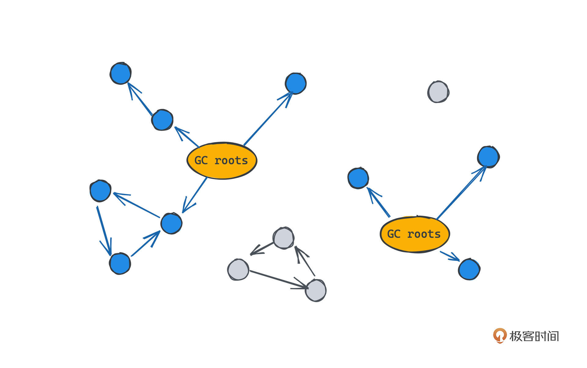
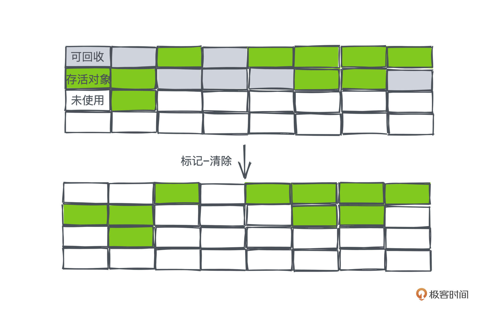
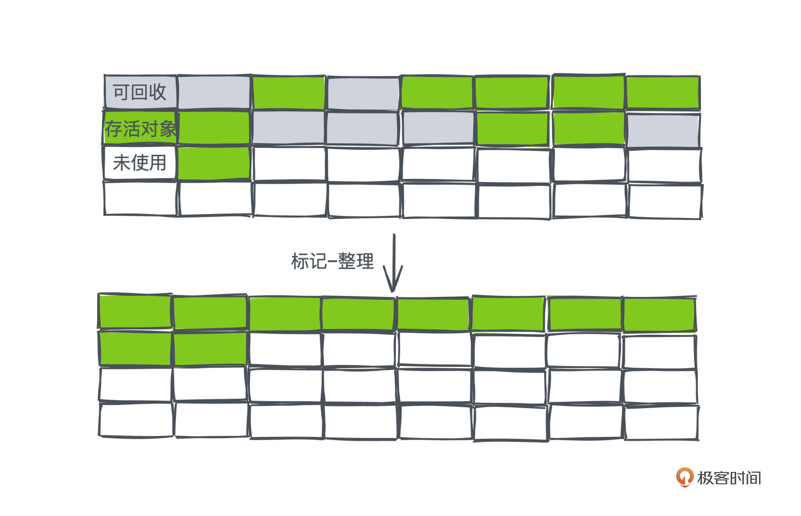

# 40｜垃圾回收：现代语言是如何自动管理回收内存的？
<audio src='./40｜垃圾回收：现代语言是如何自动管理回收内存的？.mp3' controls></audio>
你好，我是微扰君。

今天我们来聊一聊和编程语言有关的一个话题——垃圾回收，作为现在许多编程语言都支持的特性，垃圾回收机制能大大解放程序员的心智，让我们把主要精力放在实现业务逻辑上，而不是关注内存分配这样繁琐的编程细节上。

如果你写过C语言的话，一定能深切体会到在堆上分配内存是一件多么麻烦的事情。就我个人来说，只要能在栈上分配的内存，我一定尽量都在栈上分配，因为一旦在堆上分配了内存，我们就得时刻谨记要在一个合适的时机把内存释放掉。

其实，释放内存本身并不难，但是在程序的复杂性越来越高的时候，这会带来越来越高的维护成本。

因为当程序中有许多不同的分支时，一旦要修改代码，就需要确保在每个分支下内存都能得到正确地释放，这样，我们每次写关键业务逻辑的代码时，都需要反复斟酌和业务本身没有关系的内容，这就给我们程序员们带来了巨大的心智负担。这也是为什么写过C语言的同学，再去写Golang和Java这样有垃圾回收特性的语言会觉得非常爽，开发效率也能显著提高。

但是，GC的实现会带来不小的性能开销，在一些性能敏感的场景，比如高频交易或者网关中间件等场景下，我们还是会用到C\\C++这样内存分配自主可控的语言。

不过在很多互联网业务场景下，我们其实并没有这么极致的性能追求，偶尔的服务时延抖动在分布式架构下并不造成用户体验的损失。

垃圾回收机制的引入，能让程序自动管理堆上内存分配的生命周期， **开发者基本不用考虑繁琐的内存分配细节，可以大大提高业务人员的开发效率，以适应互联网快速迭代的特性**，对互联网应用来说就是绝佳的选择了。也因此，Golang和Java在互联网公司中得到了非常广泛的使用。这就是开发效率和运行效率的权衡了，也是计算机世界的经典命题之一。

那垃圾回收算法具体是怎么做的？不同的算法又有哪些不同的设计思路呢？我们接着聊。

## 垃圾回收的作用

从前面讲的能总结出来，一个垃圾回收器，主要的作用就是帮助我们开发者管理动态内存的分配请求。

所谓动态内存，就是我们通常说的堆区的内存，供一些生命周期比较长且大小不确定的对象使用，与堆区相对的概念就是常提到的栈区的内存，这里的栈，指的是函数调用栈，我们在 [栈的章节](https://time.geekbang.org/column/article/469504) 也提过相关的概念，你可以复习一下。

动态内存分配在业务开发里是必不可少的，因为只分配不释放，就会造成内存泄漏的问题，而各种语言之所以引入了垃圾回收机制，正是为了让内存回收的部分由计算机自动完成。

所以一个垃圾回收器一般至少要有这么几点职责：

- 从操作系统申请和释放动态内存
- 根据应用的请求提供相应的内存
- 决定内存中的哪些空间仍在被应用使用中
- 把不再继续被应用使用的空间声明为可使用的空间

## 不同的垃圾回收算法

那Golang和Java的垃圾回收具体是怎么做的呢？如果你对这两门语言有一定使用经验应该知道，它们采用的是不同的垃圾回收机制。

垃圾回收，一度也是学界的热点，不同的垃圾回收算法当时层出不穷，有的侧重减少每次垃圾回收程序的停止运行时间，有的则侧重提高垃圾回收的实际效率，所以Golang和Java的垃圾回收算法选择不同也就在情理之中了。

我们就以这两门语言简单举个例子。Golang相比于Java来说确实是一门更现代的语言，在语言实现上采用了更强的内存分配器，而且通过引入更完备的逃逸分析机制等手段 **一定程度上避免了大量小对象的产生，所以Golang并不像Java那么需要快速的GC**，也就没必要引入分代GC这样的复杂设计了。

事实上，Java的不同版本所用的垃圾回收机制也不一样，比如JDK社区目前比较新且活跃的垃圾回收器实现是ZGC，它的一些设计目标是这样的：

1. 停顿时间小于10ms
2. 使得停顿时间和使用中的内存大小无关
3. 支持更大规模的堆空间

我们今天主要学习两种简单、经典的垃圾回收算法：标记-清除算法、标记-整理算法，它们体现了各种现代语言中常见的垃圾回收器的基本思想，我们前面说到的分代的JVM的垃圾回收器里，就有用到这两种算法。

不过在此之前，我们还是要先来理解清楚垃圾回收里“垃圾”到底是如何定义，以及如何被计算机识别的。

## 内存垃圾标记算法

前面我们讲到，垃圾回收主要就是要避免开发者手动回收内存，所以内存中的垃圾指的就是：某段被开发者申请用于存储某个对象的内存空间，如果在某个时间之后，该对象生命周期已经结束，我们就可以将这个内存空间释放出来并重新利用。从这个意义上来说，“垃圾回收”本质上就是一个非常好的比喻。

那什么样的对象是可以被释放的呢？

通常来说，如果对象被一个正在活跃的对象所引用，这个对象就仍在被使用中，而如果某个对象已经没有被任何活跃对象引用的话，我们就可以认为这个对象已经是一个垃圾，可以回收了。

那可以想见，所有的对象之间如果以引用关系为边，一定会构成一个 **有向图**。其中有一些节点入度为零，我们就称为GC根对象，常见的根对象包括活跃中的进程、线程或协程、方法区中的静态变量等等。

**要标记某个对象是否可以仍在使用中，一种方式就是从每个根对象出发，按照引用关系遍历所有能达到的节点，这些节点就是仍在被使用中的对象**；而剩下的节点就被我们称为不可达对象，也就是可以被回收的垃圾。

这样我们就有了标记垃圾的办法。在程序运行过程中，我们就可以定期或者在需要的时候进行这样的搜索，标记出所有可以被回收的内存中间，然后进行回收。

不过可以想见，在这个搜索的过程中，我们最好不要让新的引用关系产生或者消失，这样才能保证垃圾回收算法的正确性，这也是为什么我们的垃圾回收器通常需要一个停顿时间（stop the world time），而减少这个时间也是许多垃圾回收器的设计目标。不过，这也是一个很复杂的话题，我们今天就不展开讨论了，感兴趣的话你可以看 [这篇文章](https://www.overops.com/blog/improve-your-application-performance-with-garbage-collection-optimization/#:~:text=Continuous%20%E2%80%9CStop%20the%20World%E2%80%9D%20Events%20%E2%80%93&text=If%20a%20GC%20event%20requires,are%20stopped%20to%20allow%20GC.)。

根据这种思路，下面我们看两种主流、经典的垃圾回收算法：标记-清除算法、标记-整理算法。

## 标记-清除算法（Tracing Collector）

标记清除算法，顾名思义，整个算法分为标记和清除两个部分。

标记的部分其实就是之前介绍的搜索算法。有了标记的结果，下一步就是将标记的对象全部释放。

你可以把内存想象成一个连续的数组空间，每个对象在空间里占用了一定的槽位，我们会将内存空间分成三种不同的标记，分别是存活对象、可回收空间、未使用空间。这里画了一个示意图供你参考：

当垃圾回收触发的时候，我们扫描完整个内存空间获得了相应的标签之后，就会将所有可回收的区域直接标记为“未使用”的状态，这样申请内存的时候就可以直接使用了。

从时间复杂度上来说，回收过程的代价最少就是遍历一遍所有可回收对象而已，在大部分内存都被活跃对象占用的场景下，效率是非常高的。

但这个算法最大的问题是“内存碎片”的产生。因为我们不会对内存做任何整理的操作，而只是简单释放，这会导致随着程序的运行，我们能使用的、大的连续的内存空间越来越少，大量在存活对象之间的内存空间，可能由于过小而无法得以有效利用。

## 标记-整理算法（Compacting Collector）

为了解决内存空间碎片的问题，第二种标记-整理算法应运而生。

它和标记-清除算法的主要区别体现在第二步回收上，我们不再只是简单地把可回收的对象空间标记成“未使用”，而是会把所有仍然存活的对象往内存空间的一端移动，让内存空间可使用的部分都连续集中在内存空间的另一侧。

这样我们就不再会产生众多的内存碎片，但同时也需要付出更大的移动对象的成本。

了解了这两种算法的设计思路，它们在使用选择上也自然有所不同。在商业的Java虚拟机中，我们都采用了分代的垃圾回收实现，在老生代中通常采用标记-整理的方式进行垃圾回收，这是因为老生代中的对象生命周期往往比较长，GC触发的频率不高，我们就可以接受更长的停机时间来获得更有效的内存空间利用率。

## 总结

垃圾回收是为了实现自动化地分配回收内存空间，从根对象开始，根据引用关系搜索内存空间，可以帮助我们分辨出哪些内存空间是可以被重新利用的，再通过垃圾回收算法，清除或整理对应的内存即可。

为了保证垃圾回收算法的正确性，在垃圾回收的过程中，我们通常需要停止应用程序继续在内存上分配或者释放空间，从而引入了停顿时间STW，这是各大垃圾回收算法所努力的目标。

### 课后思考题

你知道自己熟悉的语言中垃圾回收器都做了哪些努力减少停顿时间吗？

欢迎你在留言区与我一起讨论，如果你觉得课程对你有帮助的话，也欢迎转发给你的朋友一起学习。