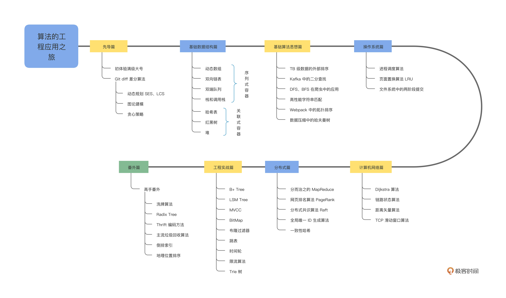

# 开篇词｜真实世界的算法，和你想的不一样
<audio src='./开篇词｜真实世界的算法，和你想的不一样.mp3' controls></audio>
你好，我是黄清昊，毕业于上海交通大学信息工程专业，Hashdata 数据库内核工程师，公众号微扰理论作者。

在LeetCode上，我还有一个名字叫“微扰理论”（之后就以微扰君自称），刷了800多道题，贡献了200多篇优质算法题解，可以说对算法学习很有心得了。

提到算法，不知道你有没有这样的疑惑。之前花很多时间学的算法和数据结构，好像就是为了应对算法面试，对日常的开发工作没有什么帮助。

入职之后，往往做着增删改查的活，算法的存在感，最多就是调用调用JDK的包、STL的函数，算法就像是只存在于那些开箱即用的中间件和基础库中而已，和我们的日常开发没什么关系。

而且学习算法的过程还很痛苦，不只是学习曲线比较陡峭，主要还是因为平时可能完全用不到这些知识点，没有连续的时间投入和充分的刻意练习。

**许多同学在工作中没什么机会和需求要手写一些基础的数据结构，只是偶尔想起来才做一做LeetCode，很容易发现刚学完的知识点根本记不住，边学边忘。** 于是开始日常吐槽算法难学，工作中又用不到，不理解大厂面试为什么问这么多算法题，毕竟我们都知道算法面试的著名槽点就是“面试造火箭，工作拧螺丝”。

这确实是一种非常普遍的疑惑。我刚毕业那会也是这么想的。

01

和很多同学一样，我也不是科班出身，不过因为对算法相当感兴趣投入很多时间练习，后来又加入了学校的网络工作室，做了许多偏应用的开发，大三顺利进入阿里实习并转正成为前端工程师。当时觉得自己作为全栈，拳打React，脚踢Spring，比周围只懂理论却毫无动手能力的同学厉害得多，优越感油然而生。

但又和很多同学一样，这样的良好感觉也并没有持续太久。

毕业半年左右我开始感觉日常的增删改查工作非常无聊，写简单的业务代码好像真的只是体力活。因为所在的团队偏创业团队，资源有限，流量很低，所以日常工作中探寻业务价值远多于技术价值。和同事交流，最多也就是学一学代码规范和常用的设计模式，非常没有挑战性，我逐渐失去了对技术的敬畏心。

但现在工作多年回头看，这只是因为当时的自己在工作中的深度还没有达到一定程度，才对计算机基础知识的应用比较少。而事实上，掌握计算机基础知识，学好数据结构和算法，尤其是真实世界的算法，是一个资深程序员的必备素养。

02

我们知道衡量程序运行快慢的一个理论依据就是时间复杂度，这也是面试算法环节重要的考察点， **但只考虑时间复杂度显然不够，程序的运行时、操作系统的各种开销都需要考虑到**。因为在我们工作的真实世界中，算法数据结构和计算机基础知识，是紧密联系在一起的，对代码的性能产生着至关重要的影响。

很多非科班同学在刚开始学习算法时，可能都会忽略运行时和操作系统的开销，而这在面试中其实经常会考查到的。

当时我第一次社招跳槽面试微软一个存储相关的岗位，面试官问了一个算法问题，因为刷了很多题，我很快就写完了代码。而再被追问代码瓶颈在哪里时，我就只是一直分析算法复杂度觉得没有任何问题，信心满满，最后却只拿到了weak hire，当时我很不理解（weak hire 是一个比较中间的评价，但实际上大部分面试官一般是考虑不录用的）。

过了好几个月，我才终于意识到面试官的意思是要考虑算法在真实的物理机器上运行的情况。我当时写的代码中有一段循环，里面开了一个比较长的数组，导致程序反复地向操作系统申请堆内存；而且我在代码中不断地对数组进行插入操作，这也会导致数组频繁扩容。正确的做法则是，事先考虑好应该申请多少空间，就可以避免持续扩容操作，从而提高程序的运行效率。

但要了解清楚这些事情，显然需要对算法、数据结构、操作系统、程序是如何运行的、内存是如何分配的等知识都有比较清晰的认识才行。 **毕竟，真实世界的算法，远不是时间复杂度这么简单**。

03

而在日常开发中，我们就更要考虑这些问题。良好的算法和计算机基础知识才能让我们写出真正高效运行的程序。

许多程序员总是以架构师为目标，在技术上热衷追求新的框架、新的架构，只关注那些看似高大上的架构设计、微服务、云原生等概念，但当架构真的出现性能瓶颈却不知道从何下手开始拆解分析。

他们学了很多，真正掌握的却很少。比如很多同学都知道Redis实现有序集合底层采用的是跳表，但跳表的实现细节、跳表和红黑树相比有什么优势，就很少有人真正理解了。 **要进行代码调优的时候，脑子里都是只了解了皮毛、但没有充分理解的知识**。

之前我维护过一个要求单机可支持百万连接的高并发长连网关，在开发时，有一个需求是需要从海量的连接中，寻找一些长期没有上下行数据的非活跃连接并移除他们，减少内存使用。

最开始的代码实现是非常暴力的，直接在存有所有连接信息的巨大HashMap中做全量扫描，依次判断每个连接是否已经满足非活跃连接的条件，显然，这会带来巨大开销，尤其当非活跃连接占比不是很高的时候。

由于之前看过Redis源代码，对LRU背后的hash-linked-list数据结构非常敏感，我看到这个需求，脑海里突然闪过一个念头，如果在内存里维护一个基于最近一次上下行事件时间排序的hash-linked-list呢？关闭非活跃连接的时候，只需要从这个有序列表的头部开始遍历，到第一个没有数据上下行的链接之后就不再需要继续遍历了。

如果只分析时间复杂度的话，你会发现这两个方案，从扫描连接的开销上来说，都是O(N)的复杂度，因为最差情况下可能所有的连接都是非活跃的。但很显然，在我们的场景中，非活跃连接占比是很低的，基于hash-linked-list的实现方案扫描连接的开销，远远小于全量扫描哈希表的开销。

在工作中，我们只有掌握优秀算法的精髓，才能根据实际的workload选择合适的算法。

04

优秀算法思路值得借鉴，但在实际写的时候，可能也还会有更多值得考虑的细节。比如在引入hash-linked-list之后，维护整个数据结构就需要保证并发读写的线程安全，因而带来了锁的开销。

所以很多时候，实际的问题，我们甚至不太好简单地通过理论分析，就得出哪个解决方案是更优的，还需要进行实验对比，不断提出新的猜想和优化方案，直到系统的性能逐步趋于完美。

而提出这些性能调优的方案，就需要我们对基础的数据结构和常用中间件的底层原理比较了解了。虽然在一些偏业务的开发中，不见得都能亲自实现这样比较底层的数据结构，但了解它们， **一定也会对我们平时的开发和问题排查带来巨大的好处**。

毕竟如果你的算法基础不太好，比如理解一个简单的基于数组实现的循环队列都很困难。那当其他人讨论着不同数据结构的优劣和性能瓶颈在哪里，或者复杂场景下各种方案的区别和可能的验证手段时，相信你是很难跟上节奏的。

这也是为什么这个专栏主题是真实世界的算法、工程中的算法。我希望能真正帮助遇到类似问题的你，我们不只会讨论基础的数据结构和算法思想，更会着重掌握这些算法是如何运行在真实的物理机器上的，如何解决实际业务系统中的问题，还有具体是如何在各个稳定运行的中间件、分布式系统、基础库中实现的。

专栏主要分为偏基础和偏实战的两部分，共6个篇章，精讲我们在工作中真正用得上的算法。

不过正式学习之前，我们会通过一个“简单”、有趣、常用的文本差分算法为先导，探索那些就在我们身边却常常被熟视无睹的算法，体验思维的乐趣。最后会挑选出几个有趣的算法，在高手番外篇中不定期奉上。

- 数据结构篇、算法思想篇

这两个模块，包含了工程中常用的基础数据结构和算法思想，比如双向链表、动态数组、哈希表、红黑树、二分搜索、深度优先搜索等，由浅入深，推演算法的来历和特点，分析源码实现思路，不只是了解算法知识，更要理解工业级的算法实现是如何运行在真实的物理机上的。

- 操作系统篇、计算机网络篇

这两个模块，会带你学习两门非常重要的计算机基础课——操作系统和计算机网络中会用到的基础算法，同样会结合真实的网络库、操作系统的源码进行讲解。这样当你了解许多经典算法的发明背景和应用场景时，再结合操作系统和计算机网络的基础知识，你可以对算法有更深入的理解。

- 分布式篇、工程实践篇

学习高流量、高并发、高可用的现代互联网应用中各种算法的应用，解析Redis、MySQL和MapReduce等系统或者论文的经典源码。深入理解在各场景下如何拆解问题、应用算法，目的是升级编程思维，帮助你排查真实业务开发中的各种问题，做出良好的架构设计。

当然那些生产环境下稳定运行的系统源码，大多数时候非常复杂，但当你拨开云雾，搞清楚其中的算法思想，并且融汇到你的工作中时，相信我，你一定会觉得当程序员是一件非常快乐的事情。

而且不得不提的一点是，学习这些数据结构和算法的过程本身其实也非常有趣，练习能很好地锻炼我们的编程思维。你不仅能通过对算法的充分训练真切地体会到思维敏捷和思路清晰，而且 **在工作中遇到的实际问题中，你往往也能更快也更全面地考虑到各种边界情况，并比较准确、优雅地写出正确的实现**。

聊到这里估计有同学会疑惑，既然算法的实际应用更有意义，那算法题还要刷吗？

是的，不过我们只是把刷题作为方法，而不是目的。我认为做算法题对帮助我们充分理解算法是大有裨益的，这也是为什么我即使现在没有换工作的计划，也一直在坚持参加力扣的周赛。磨刀不误砍柴功，非常推荐你进行长期不间断的算法训练，磨练自己的思维能力，所以在专栏里，我也会附上一些和知识点相关的经典面试算法题，这可以更好地帮助你理解和记忆相关的知识点。

祝你在这段算法学习之旅中，可以真的感受到算法学习真的是一件非常有乐趣，也非常有成就感的事情，就让我们一起来探索工程实战中，每天都存在的算法问题吧，以这个专栏为期，相信你坚持到最后一定会感觉到明显的进步。